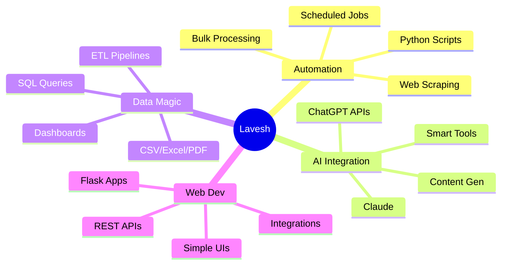

<div align="center">
  
</div>

<div align="center">
  
  [](https://github.com/laveshnagda24-oss)
  
</div>

<br>

<table align="center">
<tr>
<td width="50%" align="center">
  
  ### 🚀 Quick Intro
  
  ```typescript
  const lavesh = {
    location: "Mumbai 🌆",
    age: 24,
    style: "AI-assisted coding",
    motto: "Automate or die trying",
    status: "Available for hire 💼"
  }
  ```
  
</td>
<td width="50%" align="center">
  
  ### 💡 The Vibe
  
  **From Operations → Developer**
  
  Spent 2 years watching people
  do repetitive tasks manually
  
  Thought: *"Why tho?"* 🤔
  
  Started coding to fix it ⚡
  
</td>
</tr>
</table>

---

<h2 align="center">⚡ My Superpowers</h2>

<div align="center">



</div>

---

<h2 align="center">🛠️ Tech Arsenal</h2>

<div align="center">

<table>
<tr>
<td align="center" width="100">

<br>Python
</td>
<td align="center" width="100">

<br>JavaScript
</td>
<td align="center" width="100">

<br>Node.js
</td>
<td align="center" width="100">

<br>Flask
</td>
<td align="center" width="100">

<br>PostgreSQL
</td>
<td align="center" width="100">

<br>Git
</td>
</tr>
<tr>
<td align="center" width="100">

<br>VS Code
</td>
<td align="center" width="100">

<br>Postman
</td>
<td align="center" width="100">

<br>ChatGPT
</td>
<td align="center" width="100">

<br>Pandas
</td>
<td align="center" width="100">

<br>MySQL
</td>
<td align="center" width="100">

<br>SQLite
</td>
</tr>
</table>

</div>

---

<h2 align="center">🎯 What I Actually Build</h2>

<table align="center">
<tr>
<td width="33%" align="center">

### 📧 Smart Automation
Auto-categorize emails
<br>Generate AI responses
<br>Save 100s of hours

**Tech:** Python • AI APIs • Flask

</td>
<td width="33%" align="center">

### 🎨 Content Tools
Blog → Social posts
<br>Multi-platform repurposing
<br>AI-powered generation

**Tech:** OpenAI • Python • NLP

</td>
<td width="33%" align="center">

### 🖼️ Bulk Processing
Resize/compress/convert
<br>Batch operations
<br>Simple web interface

**Tech:** Pillow • Flask • JS

</td>
</tr>
<tr>
<td width="33%" align="center">

### 💰 Price Trackers
Monitor e-commerce
<br>Alert on price drops
<br>Multi-site scraping

**Tech:** BeautifulSoup • SQLite

</td>
<td width="33%" align="center">

### 📊 API Testers
Visual API testing
<br>Save test cases
<br>Response formatting

**Tech:** Flask • REST • JSON

</td>
<td width="33%" align="center">

### 📝 Data Extractors
PDF/Invoice parsing
<br>Structured data export
<br>Automated workflows

**Tech:** PyPDF2 • Regex • SQL

</td>
</tr>
</table>

---

<h2 align="center">💭 The Secret Sauce</h2>

<div align="center">

```diff
@@                   My Development Philosophy                    @@

+ I don't just write code - I solve real problems
+ Operations background = I understand business pain points
+ AI-assisted = Build 5x faster without compromising quality
+ Learn by building = Theory is boring, production teaches best
+ Ship first, perfect later = Done > Perfect

- ❌ No fancy frameworks for the sake of it
- ❌ No over-engineering simple solutions  
- ❌ No building features nobody asked for
```

</div>

<br>

<div align="center">
  
  ### 🎬 My Process
  
  ```
  Problem 🔍 → AI Assist 🤖 → Build Fast ⚡ → Debug 🐛 → Ship 🚀 → Iterate 🔄
  ```
  
</div>

---

<h2 align="center">🔥 Why Work With Me?</h2>

<table align="center">
<tr>
<td>

### ✅ You Get:
- Someone who **understands business**, not just code
- **Fast delivery** using AI-powered development
- **Practical solutions** that actually work
- Clean, maintainable code
- Clear communication (no jargon BS)

</td>
<td>

### ❌ You Don't Get:
- Over-complicated architecture
- Weeks of "planning" before coding
- Features you didn't ask for
- Academic explanations
- Buzzword bingo

</td>
</tr>
</table>

---

<h2 align="center">📫 Let's Build Something</h2>

<div align="center">

### 🤝 Open For

**Full-time roles** • **Freelance projects** • **Collaborations** • **Contract work**

<br>

[](mailto:laveshnagdda24@gmail.com)
[](https://www.linkedin.com/in/lavesh-nagda-169b79217/)
[](#)

<br>

**📍 Location:** Mumbai (Andheri) - Available for in-person  
**💰 Rate:** Negotiable based on project  
**⚡ Response Time:** Usually within 24 hours  

</div>

---

<div align="center">

### ⚡ Quick Facts About Me

🎯 Turned 2 years of ops frustration into coding skills  
🤖 Build with AI assistance (ChatGPT, Claude, Cursor)  
📦 Shipped automation that saved 70% manual work  
🚀 Learn by doing, not by reading  
☕ Best code happens at 2 AM with coffee  
🎮 When not coding: Tech Twitter + Mumbai street food  

</div>

---

<div align="center">
  
  
  
  **"Automate the boring stuff, build the cool stuff" 🚀**
  
  
  
  *Made with ❤️ and AI assistance • Lavesh Nagda © 2025*

</div>
